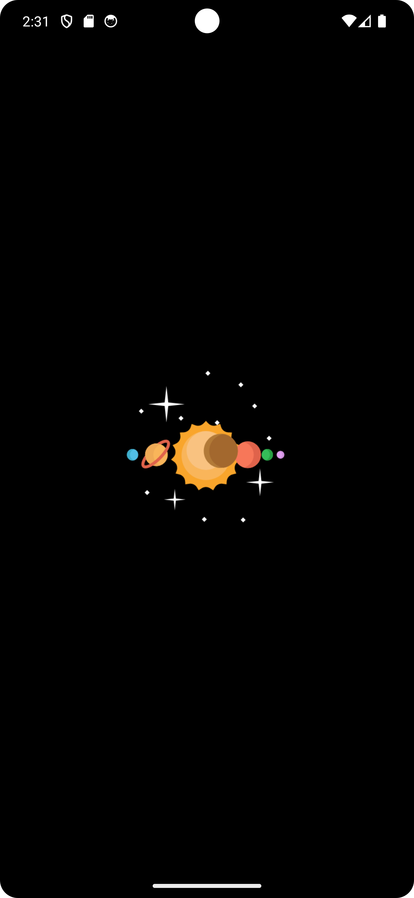
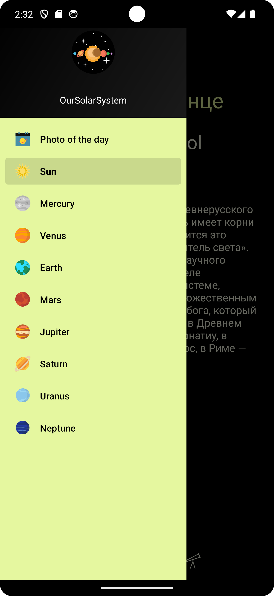
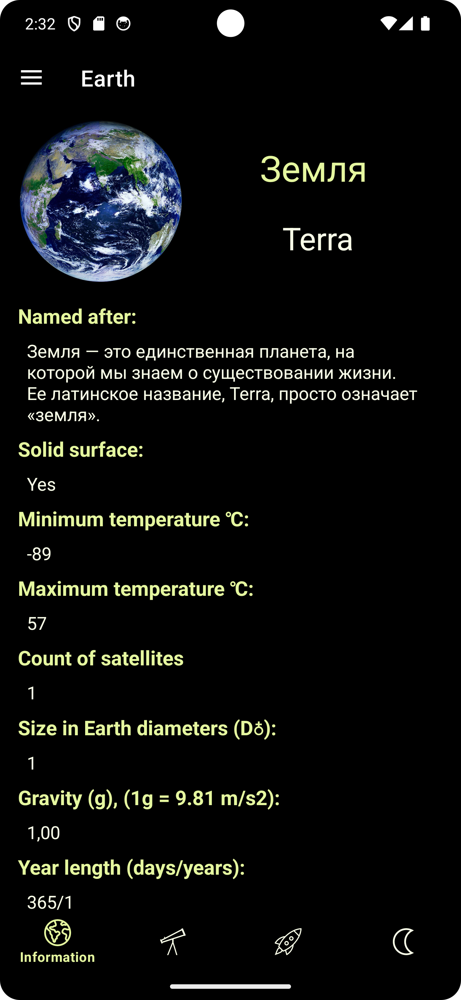
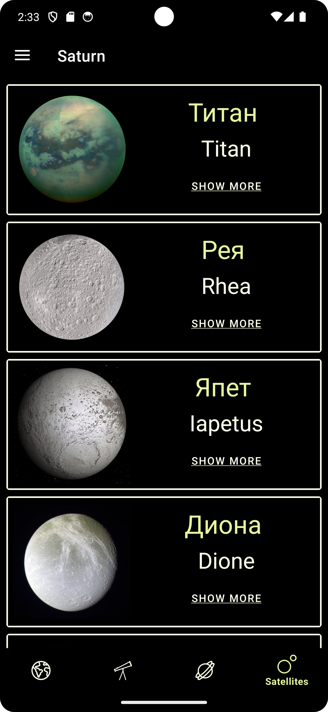
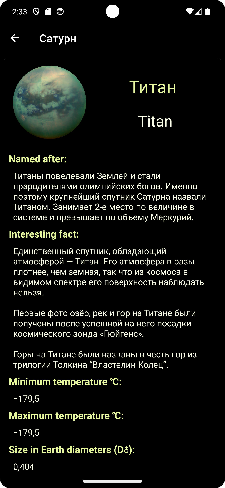

## Наша солнечная система

**Бета-версия. Приложение не закончено**

                

- приложение о нашей Солнечной системе, о планетах и самых крупных спутниках

            

- Библиотеки:
  Coroutines, Recyclerview, Navigation, Dagger Hilt, Retrofit, GSON, OkHttp, Glide
- Архитектура MVVM
- Весь UI в соответствии с рекомендациями Material Design

